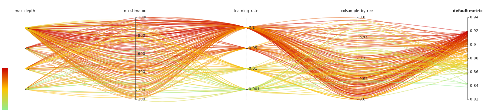
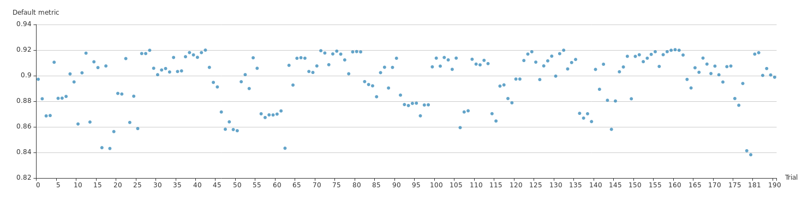
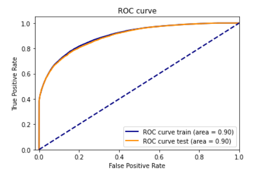
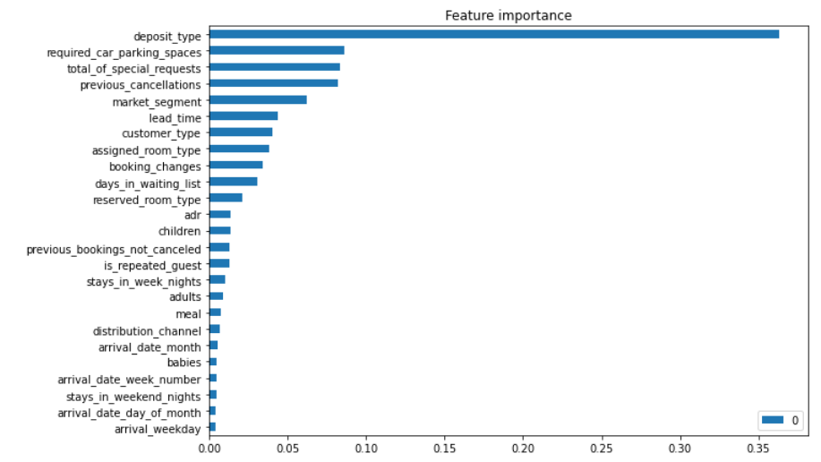
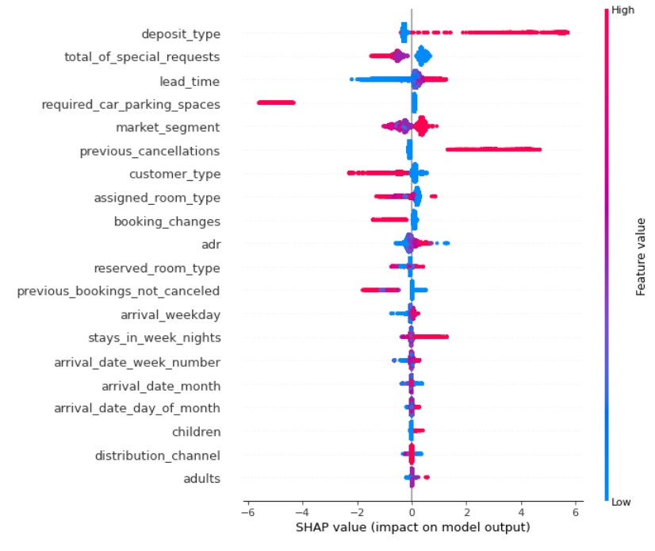
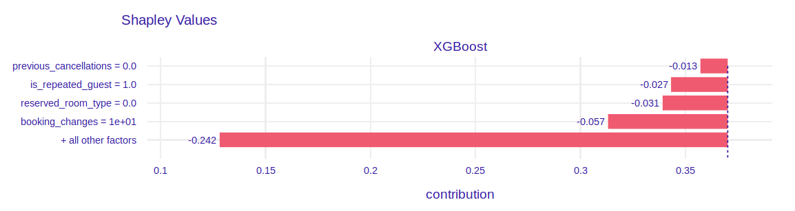
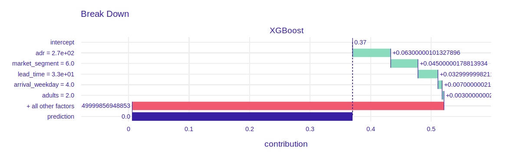
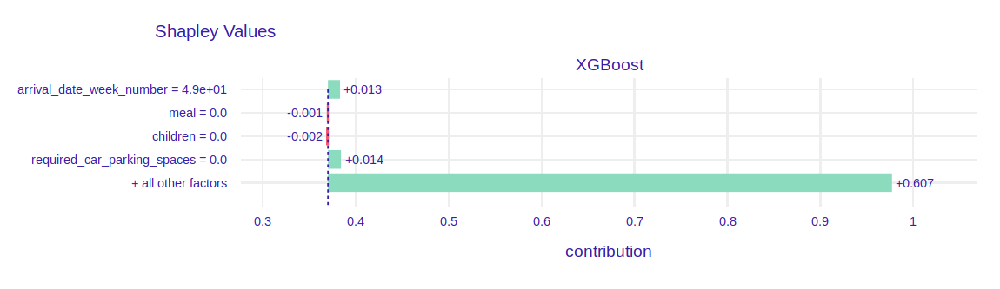
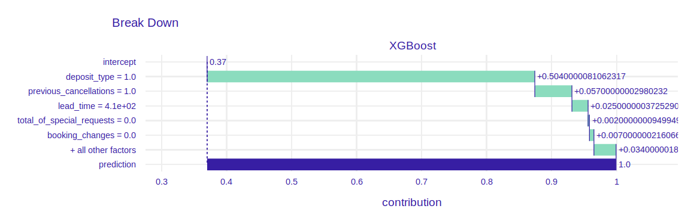

# Story hotel booking: eXplainable predictions of booking cancellation and guests coming back {#story-hotel-booking}

*Authors: Domitrz Witalis (MIM), Seweryn Karolina (MiNI)*

*Mentors: Jakub Tyrek (Data Scientist), Aleksander Pernach (Consultant)*

## Introduction 

The dataset is downloaded from the Kaggle competition website https://www.kaggle.com/jessemostipak/hotel-booking-demand.
This dataset contains booking information for a city hotel and a resort hotel in Portugal, and includes information such as when the booking was made, length of stay, the number of adults, children, babies, the number of available parking spaces, chosen meals, price etc. There are 119 390 observations and 32 features. Below you can find features which were used in modelling. Furthermore, feature *arrival_weekday* was added.

| | Feature  | Description  |
|---|---|---|
| 1 | hotel  | Resort hotel or city hotel |
| 2 |is_canceled  | Value indicating if the booking was canceled (1) or not (0) |
| 3 | lead_time  | Number of days that elapsed between the reservation and the arrival date |
| 4 |arrival_date_month | Month of arrival date |
| 5 | arrival_date_week_number | Week number of year for arrival date |
| 6| stays_in_weekend_nights | Number of weekend nights (Saturday or Sunday) the guest stayed or booked to stay at the hotel |
| 7| stays_in_week_nights | Number of week nights (Monday to Friday) the guest stayed or booked to stay at the hotel|
| 8 | adults | Number of adults |
| 9 | children | Number of children |
| 10 | babies | Number of babies |
| 11|meal | Type of meal booked |
| 12 |is_repeated_guest | Value indicating if the booking name was from a repeated guest |
| 13|previous_cancellations | Number of previous bookings that were cancelled by the customer prior to the current booking |
| 14|previous_bookings_not_canceled | Number of previous bookings not cancelled by the customer prior to the current booking |
| 15|booking_changes | Number of changes made to the booking from the moment the booking was entered on the PMS until the moment of check-in or cancellation |
| 16| deposit_type | Indication on if the customer made a deposit to guarantee the booking. This variable can assume three categories: No Deposit – no deposit was made; Non Refund – a deposit was made in the value of the total stay cost; Refundable – a deposit was made with a value under the total cost of stay |
| 17| days_in_waiting_list | Number of days the booking was in the waiting list before it was confirmed to the customer |
| 18| adr | Average Daily Rate as defined by dividing the sum of all lodging transactions by the total number of staying nights |
| 19 | required_car_parking_spaces | Number of car parking spaces required by the customer |
|20 | total_of_special_requests |Number of special requests made by the customer (e.g. twin bed or high floor)|
| 21 | market_segment | Market segment designation. In categories, the term “TA” means “Travel Agents” and “TO” means “Tour Operators” |
| 22 | customer_type |Contract - when the booking has an allotment or other type of contract associated to it; Group – when the booking is associated to a group; Transient – when the booking is not part of a group or contract, and is not associated to other transient booking; Transient-party – when the booking is transient, but is associated to at least other transient booking|
| 23 | distribution_channel | Booking distribution channel. The term “TA” means “Travel Agents” and “TO” means “Tour Operators” |

The booking website has information about these reservation characteristics and building models can help this company in better offer management. The most important information could be 

* the prediction of booking cancellation, 
* the prediction if client comes back to the hotel,
* the prediction whether client orders additional services (eg. meals),
* customer segmentation.

In this project, we have decided to focus on two first issues.

### Hyperparameter optimization

### Imbalanced dataset

[Put a description of the problem here. indicate the data source. Describe why this problem is important. Indicate the most important literature on the problem.]

## Model 

### Model 1. Booking cancellation

The aim of this model is to predict whether guest cancels reservation and explanation of the reasons. The chosen model is XGBoost with RFE (Recursive Feature Elimination). Bayesian optimisation with TPE tuner has been applied in order to improve model performance. Neural Network Intelligence (NNI) package has been chosen for this task, because it provides user-friendly GUI with summary of experiments.

List of optimized hyperparameters and search space:

1. **max_depth** - the maximum depth of tree.
2. **n_esimators** - the number of trees.
3. **learning_rate** - boosting learning rate
4. **colsample_bytree** - subsample ratio of columns when constructing each tree.

*Figure details paths of hyperparameters values chosen by algorithm. On the right you can see metric (AUC) of model with those parameters.*

*Figure presents AUC for each experiment. It shows a clear trend in model performence so algorithm is choosing better and better hyperparameters.*

|   |   |   |
|---|---|---|
|AUC train |   |   |
|AUC test   |   |   |

### Model 2. Repeated guests

Place a description of the model(s) here. Focus on key information on the design and quality of the model(s) developed.

## Explanations

### Model 1. Booking cancellation

#### Dataset level

*.*

Figure above shows SHAP values. There are some interesting findings which are intuitive:

* Clients who canceled some reservations in  the past are more likely to cancel another reservation.
* People who buy refundable option cancel reservations more often than others.
* A lot of days between reservation time and arrival time increases probability of cancelling booking. 
* People who travel with children are more likely to cancel booking.

There are also less intuitive findings:

* People without any special requests cancel reservetion more often than others.
* If trip starts at the end of the week there is higher probability that customers change their minds.
* The bigger number of adults, the highest probability of cancellation.

#### Instance level

1. The lowest prediction of cancellation probability

2. The highest prediction of cancellation probability

   
### Model 2. Repeated guests

Here, show how XAI techniques can be used to solve the problem.
Will dataset specific or instance specific techniques help more?

Will XAI be useful before (pre), during (in) or after (post) modeling?

What is interesting to learn from the XAI analysis?

## Summary and conclusions 

Here add the most important conclusions related to the XAI analysis.
What did you learn? 
Where were the biggest difficulties?
What else did you recommend?

